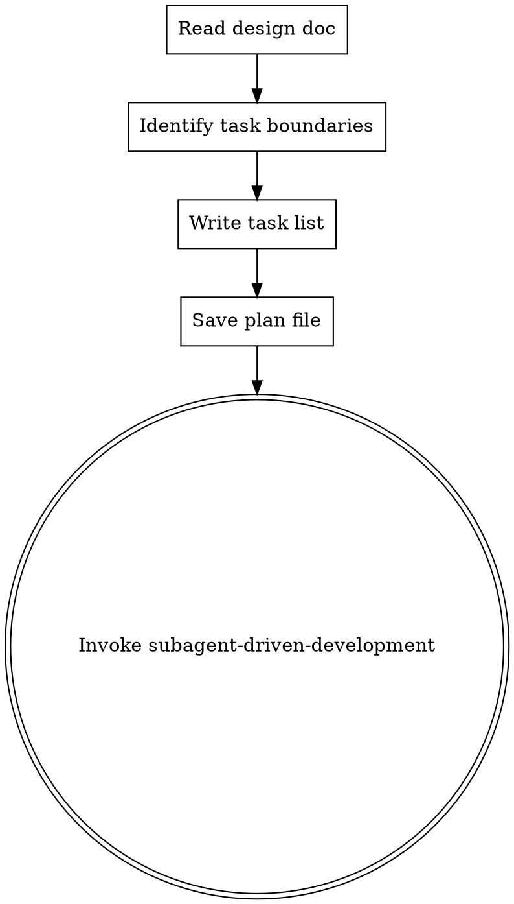

# Writing Implementation Plans

## Overview

Convert an approved design document into a concrete, ordered implementation plan, then dispatch execution via `subagent-driven-development`.

**Announce at start:** "I'm using the writing-plans skill to create an implementation plan."

## When to Use

- brainstorming design has been approved by Yuan
- need to break down the design into atomic tasks for execution
- preparing to invoke `subagent-driven-development` for implementation

## Process Flow



## Steps

### 1. Read Design Document

Read the design doc produced by brainstorming:

```
docs/plans/YYYY-MM-DD-<topic>-design.md
```

Extract:
- Feature goals and acceptance criteria
- Components and composables involved
- Architectural decisions (data flow, state management, API contracts)

### 2. Identify Task Boundaries

Split the design into atomic tasks following these rules:

- **One responsibility per task** — a task touches one layer (Page / Component / Composable / Store / API / Type) in one feature area
- **Honour dependency order** — if Task B depends on Task A's output, Task A comes first
- **TDD required** — every task that adds or changes implementation code must include writing a failing test before the implementation

### 3. Write Task List

For each task, specify:

| Field | Content |
|-------|---------|
| **功能領域** | `component` / `composable` / `router` / `store` / `api` / `ui` / `editor` / `auth` / `search` / `types` |
| **責任層** | Page / Component / Composable / Store / API / Type / Config / Style |
| **目標** | 用一句話描述這個任務要完成什麼 |
| **TDD 要求** | 先寫失敗測試，確認 Red，再寫實作，確認 Green，再 Refactor |
| **相依任務** | 列出必須先完成的任務編號（若無則填「無」） |
| **驗證指令** | `npx vitest run src/<path>/` |

### 4. Save Plan File

Write the plan to:

```
docs/plans/YYYY-MM-DD-<topic>-implementation-plan.md
```

Plan file format:

```markdown
# Implementation Plan: <topic>

## Design Reference
- Design doc: `docs/plans/YYYY-MM-DD-<topic>-design.md`
- Approved by: Yuan

## Tasks

### Task 1 — <功能領域>/<責任層>: <目標>
- **TDD**: 先寫 `<test-file>#<describe/it>` 確認 Red，再實作
- **相依**: 無
- **驗證**: `npx vitest run src/<path>/`

### Task 2 — ...
```

### 5. Invoke `subagent-driven-development`

呼叫 `subagent-driven-development` skill，以計畫內容分發執行。

## Project-Specific Conventions

This is a Vue 3 + TypeScript + Vite project. Every task must comply with:

| Convention | Rule |
|-----------|------|
| **TDD** | 每個實作任務必須先寫失敗測試（Red），再寫最少實作（Green），再重構（Refactor） |
| **Composition API** | 所有元件使用 `<script setup lang="ts">`，禁止 Options API |
| **No enum** | 使用 string literal union + `as const` object 模式 |
| **JSDoc** | Composables 需繁體中文 JSDoc（用途、參數、回傳值） |
| **Test command** | `npx vitest run src/<path>/` |
| **DOMPurify** | 所有 `v-html` 內容必須經過 `DOMPurify.sanitize()` |

## Common Mistakes

### Tasks too large

- **Problem:** A task covers multiple layers — hard to test atomically
- **Fix:** Split by layer; each task touches exactly one layer

### No TDD annotation

- **Problem:** Implementation written before test
- **Fix:** Every task description must state which test file/describe/it to write first
